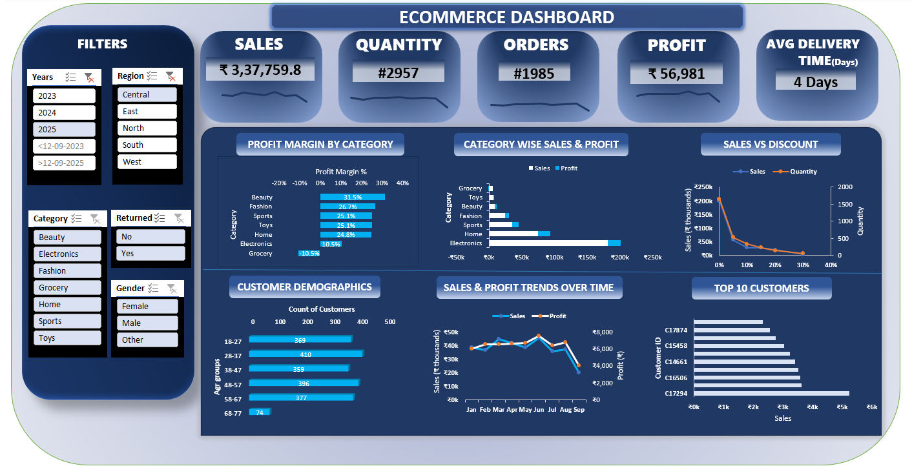

# E-commerce Excel Dashboard

An interactive, business-focused Excel dashboard designed to analyze **e-commerce sales performance, profitability, discount impact, and customer behavior**.

This project showcases strong skills in **data analysis, KPI tracking, and dashboard storytelling using Excel**.

---

## 📊 Dashboard Overview

The dashboard provides a centralized view of key e-commerce metrics to help business stakeholders:
- Monitor revenue and profit trends
- Identify high and low performing product categories
- Understand the impact of discounts on sales
- Analyze customer segments and top buyers

---

## 🔑 Key KPIs

- **Total Sales**
- **Total Orders**
- **Quantity Sold**
- **Total Profit**
- **Average Delivery Time**

---

## 📈 Key Features & Insights

### 📦 Category Performance
- Profit Margin by Category with **clear identification of loss-making categories (e.g., Grocery)**
- Category-wise comparison of **Sales vs Profit**

### 💰 Pricing & Discount Analysis
- Sales vs Discount trend to understand how discounts affect demand and revenue

### 👥 Customer Analysis
- Customer demographics by age group
- Identification of **Top 10 Customers by Sales**

### 📅 Time-Based Trends
- Monthly Sales & Profit trend analysis to track seasonality and growth patterns

---

## 🎛️ Interactive Filters

The dashboard includes slicers for dynamic exploration:
- Year
- Region
- Category
- Gender
- Return Status

All visuals and KPIs update automatically based on filter selection.

---

## 🛠 Tools & Techniques Used

- **Microsoft Excel**
- Pivot Tables
- Calculated Fields & Measures
- Advanced Excel Charts
- Slicers for interactivity
- Dashboard layout & design optimization

---

## 🖼 Dashboard Screenshot

---

## 📁 Files Included

- `Ecommerce Dashboard.xlsx` – Fully interactive Excel dashboard
- `screenshots/dashboard.png` – Dashboard preview image

---

## 🎯 Use Case

This dashboard can be used by:
- Business Analysts
- Product Managers
- E-commerce & Retail Teams

To quickly identify **profitability issues, customer behavior patterns, and data-driven business opportunities**.

---

## 🚀 About This Project

This project is part of my **Excel Dashboard Portfolio**, demonstrating my ability to convert raw data into **actionable business insights using Excel**.

## Download Dashboard
📥 [Click here to download the Excel dashboard](Ecommerce%20Dashboard.xlsx)
