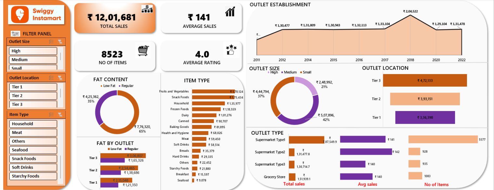

# Swiggy Instamart Excel Dashboard

An interactive, business-focused Excel dashboard built to analyze **Swiggy Instamart sales performance, outlet characteristics, and product-level insights** using real-world retail KPIs.

This dashboard demonstrates strong skills in **data analysis, visualization, and business storytelling using Excel**.

---

## 📊 Dashboard Overview

The dashboard provides a comprehensive view of Instamart operations, helping stakeholders understand:
- Overall sales performance
- Outlet distribution and contribution
- Product category performance
- Customer purchasing patterns
- Impact of outlet size and location on revenue

---

## 🔑 Key KPIs

- **Total Sales**
- **Average Sales**
- **Number of Items Sold**
- **Average Customer Rating**
- **Outlet Establishment Trend (Year-wise)**

---

## 📈 Key Insights & Analysis

### 🏬 Outlet Analysis
- Sales performance segmented by **Outlet Size (Small, Medium, High)**
- Revenue comparison across **Tier 1, Tier 2, and Tier 3 locations**
- Outlet type comparison (Supermarket Types, Grocery Store)

### 🍎 Product & Category Analysis
- Item-wise sales contribution (Fruits & Vegetables, Dairy, Snacks, Frozen Foods, etc.)
- Fat content analysis (Low Fat vs Regular)
- Category-level contribution to overall revenue

### ⭐ Customer & Operational Insights
- Average customer rating trends
- Total number of items sold per outlet type
- Outlet establishment growth trend over the years

---

## 🎛️ Interactive Filters

The dashboard includes slicers for dynamic analysis:
- **Outlet Size**
- **Outlet Location (Tier 1 / Tier 2 / Tier 3)**
- **Item Type**

All charts and KPIs update automatically based on filter selections.

---

## 🛠 Tools & Techniques Used

- **Microsoft Excel**
- Pivot Tables
- Calculated Fields & Measures
- Slicers for interactivity
- Advanced Chart Formatting
- Dashboard Design & Layout Optimization

---

## 🖼 Dashboard Screenshot

---

## 📁 Files Included

- `Swiggy_Instamart_Dashboard.xlsx` – Fully interactive Excel dashboard  
- `screenshots/instamart_dashboard.png` – Dashboard preview image

---

## 🎯 Use Case

This dashboard can be used by:
- Business Analysts
- Category Managers
- Operations Teams
- Retail & E-commerce Decision Makers

To quickly identify **high-performing outlets, top-selling product categories, and growth opportunities**.

---

## 🚀 About This Project

This project is part of my **Excel Dashboard Portfolio**, showcasing my ability to transform raw retail data into **actionable insights using Excel**.

## Download Dashboard
📥 [Click here to download the Excel dashboard](Swiggy%20Instamart%20Dashboard.xlsx)

